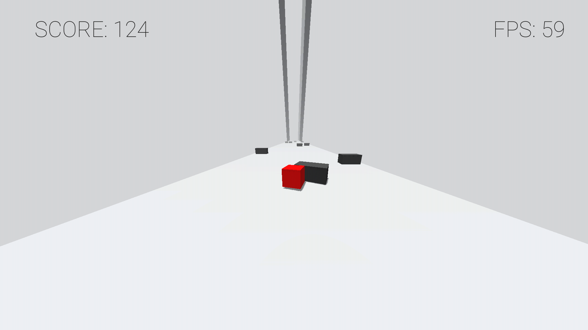
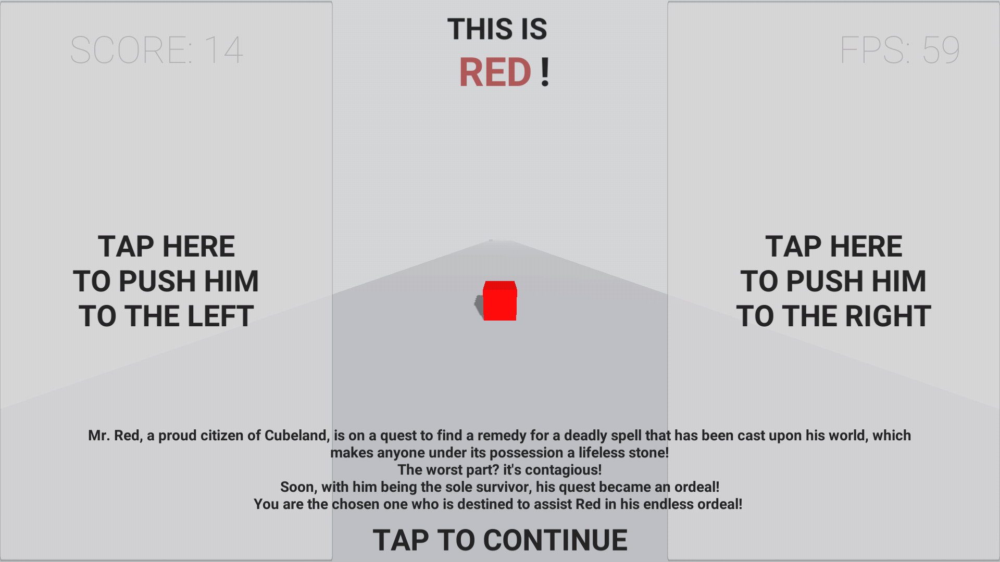
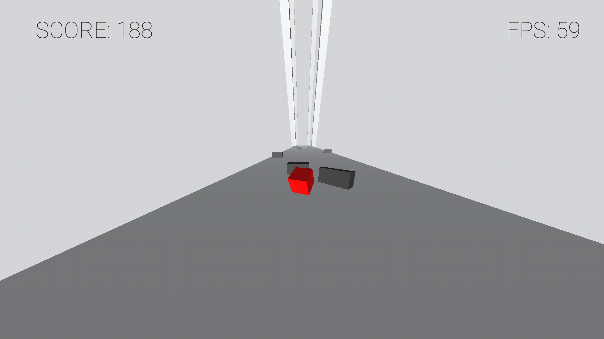
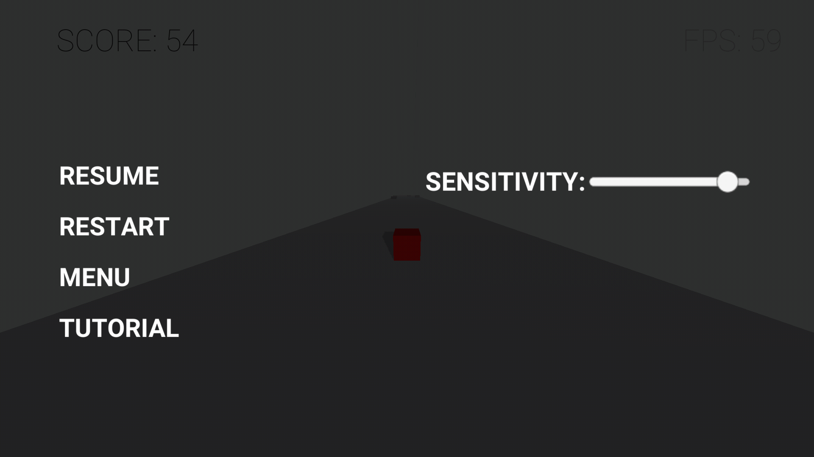
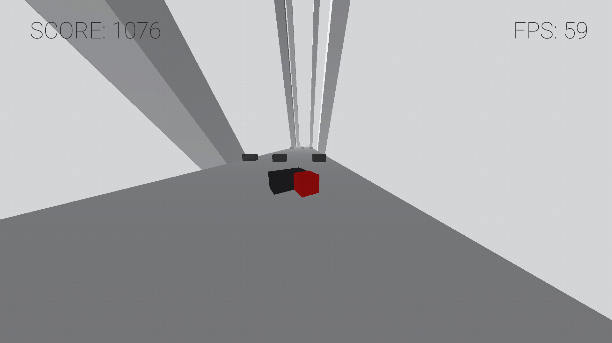
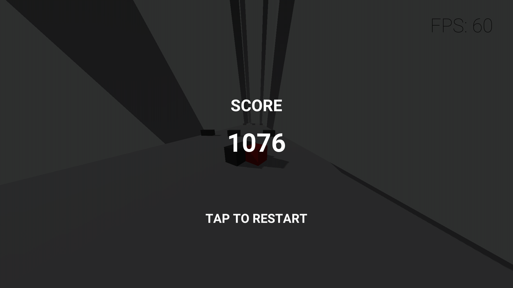

# **S\ide**

Slide (stylized as **S\ide**) is a downloadable game for Android, Windows, and Linux. An endless runner... slider game made using Unity3D.

Red, an endangered cube and our protagonist, must drift his way through an army of disunited walls!

## Story

Mr. Red, a proud citizen of Cubeland, is on a quest to find a remedy for a deadly spell that has been cast upon his world, which makes anyone under it's possession a lifeless stone!

The worst part? It is contagious!

Soon, with him being the sole survivor, his quest became an ordeal!

You are the chosen one who is destined to assist Red in his endless ordeal!

## Features

Experience the extremely fast-paced journey of Red in a hyper-casual world of cube(oid)s at 60 FPS, with dynamic shadows on any reasonably powerful Android phone.

## Download

[**Download Slide on itch.io**](https://srihk.itch.io/slide)

## Mobile Screenshots

